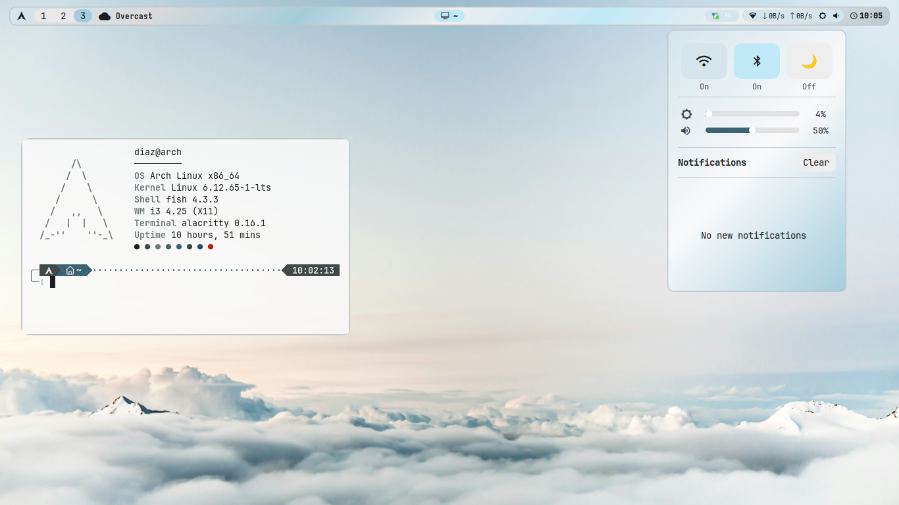
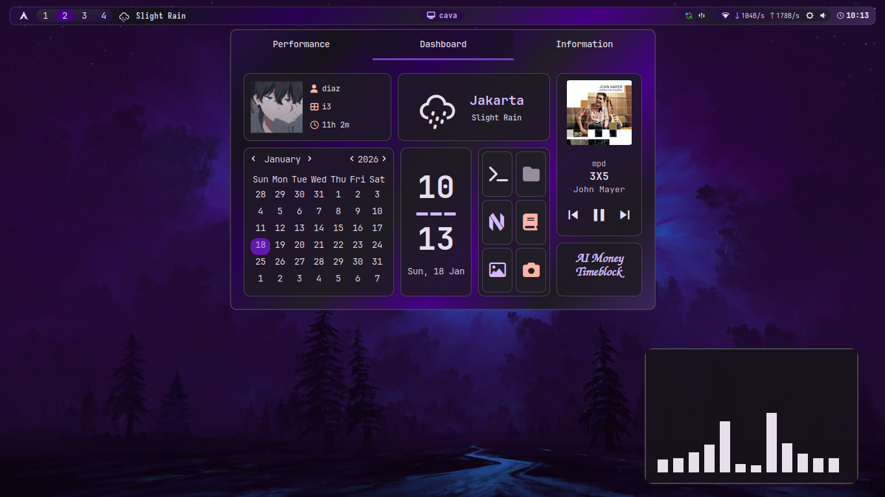
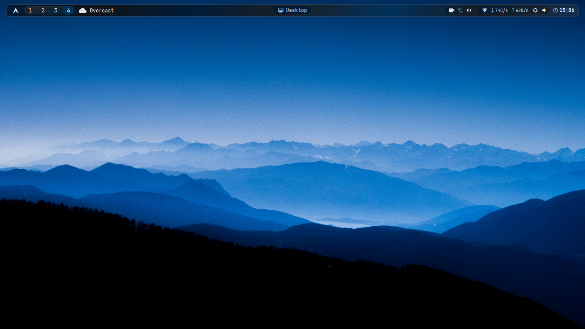

# Simple Auto-Ricing i3wm Dotfiles

<div align="center">

**Minimal i3wm with automated Material 3 theming from wallpapers**

[](https://opensource.org/licenses/MIT)
[](https://archlinux.org/)
[](https://i3wm.org/)

</div>

---

## Screenshots


**Clean Desktop**



**Busy Desktop**



**Minimalist Desktop**



---

## Features

- **Auto Material 3 Theming** - Colors extracted from wallpapers via m3wal
- **Lightweight** - Minimal resources, fast performance
- **Complete Setup** - i3wm, Eww, Alacritty, Fish, Rofi, all themed
- **One-Click Install** - Automated with backup

---

## Stack

| Component | App | Component | App |
|:---|:---|:---|:---|
| WM | i3-wm | Terminal | Alacritty |
| Bar | Eww | Shell | Fish |
| Theming | m3wal | Launcher | Rofi |
| Compositor | Picom | Notifications | Dunst |

---

## Installation

```bash
git clone https://github.com/MDiaznf23/simple-autoricing-i3wm-dotfiles.git
cd simple-autoricing-i3wm-dotfiles
chmod +x install.sh
./install.sh
```

**Script will:**
- Install all packages (repos + AUR)
- Backup existing configs to `~/dotfiles_backup_YYYYMMDD_HHMMSS`
- Install yay if needed
- Install m3wal via pipx
- Copy all dotfiles
- Set Fish as default shell
- Apply initial theme

**Then:** Logout → Select i3 → Login

---

## Usage

### Keybindings

| Key | Action | Key | Action |
|:---|:---|:---|:---|
| `Super + Enter` | Terminal | `Super + d` | Launcher |
| `Super + Shift + q` | Close window | `Super + Shift + r` | Reload i3 |
| `Super + h/j/k/l` | Focus | `Super + Shift + h/j/k/l` | Move window |
| `Super + 1-9` | Workspace | `Super + Shift + b` | Change wallpaper |

### Theming

**Change wallpaper:**
```bash
m3wal /path/to/wallpaper.jpg --full
```

**With options:**
```bash
m3wal wallpaper.jpg --full --mode dark --variant VIBRANT
m3wal wallpaper.jpg --full --mode light --variant EXPRESSIVE
m3wal wallpaper.jpg --full  # auto-detect (recommended)
```

**Variants:** `CONTENT` (default), `VIBRANT`, `EXPRESSIVE`, `NEUTRAL`, `TONALSPOT`, `FIDELITY`, `MONOCHROME`

**Modes:** `auto` (default), `light`, `dark`

---

## Configuration

### m3wal Config
`~/.config/m3-colors/m3-colors.conf`

```ini
[General]
mode = auto              # auto, light, dark
variant = CONTENT        # Color variant
operation_mode = full    # generator or full

[Features]
set_wallpaper = true
apply_xresources = true
generate_palette_preview = true
```

### Custom Templates
Create in `~/.config/m3-colors/templates/`:

```
# myapp.conf.template
background={{m3surface}}
foreground={{m3onSurface}}
primary={{m3primary}}
```

Deploy via `~/.config/m3-colors/deploy.json`:

```json
{
  "deployments": [
    {"source": "myapp.conf", "destination": "~/.config/myapp/colors.conf"}
  ]
}
```

### Hook Scripts
Create in `~/.config/m3-colors/hooks/`:

```bash
#!/bin/bash
# reload-apps.sh
killall -USR1 kitty
i3-msg reload
```

Enable:
```ini
[Hook.Scripts]
enabled = true
scripts = reload-apps.sh
```

---

## File Structure

```
~/.config/
├── i3/           # Window manager
├── eww/          # Bar & widgets
├── alacritty/    # Terminal
├── rofi/         # Launcher
├── m3-colors/    # Theming
│   ├── templates/     # Color templates
│   ├── hooks/         # Scripts
│   └── deploy.json    # Deployment
└── fish/         # Shell

~/.local/bin/     # Scripts
~/Pictures/Wallpapers/  # Your wallpapers
```

---

## Troubleshooting

**m3wal not found:**
```bash
export PATH="$HOME/.local/bin:$PATH"
```

**Fonts missing:**
```bash
fc-cache -fv
```

**Transparency broken:**
```bash
picom --config ~/.config/picom/picom.conf &
```

**Manual wallpaper:**
```bash
feh --bg-scale /path/to/wallpaper.jpg
```

---

## Advanced

### Python API
```python
from m3wal import M3WAL

m3 = M3WAL("wallpaper.jpg")
m3.analyze_wallpaper()
m3.generate_scheme(mode="dark", variant="VIBRANT")
m3.apply_all_templates()
m3.deploy_configs()
```

### Random Wallpaper
```bash
m3wal $(find ~/Pictures/Wallpapers -type f | shuf -n1) --full
```

---

## Links

- [GitHub Issues](https://github.com/MDiaznf23/simple-autoricing-i3wm-dotfiles/issues)
- [m3wal](https://github.com/MDiaznf23/m3wal)
- [Arch Wiki - i3](https://wiki.archlinux.org/title/I3)

---

<div align="center">

**Made with ❤️ for Arch Linux**

⭐ Star if helpful!

</div>
