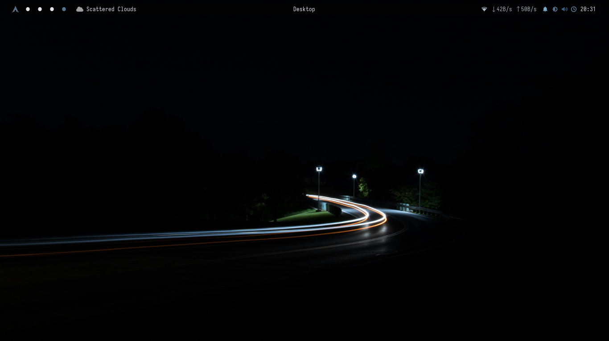
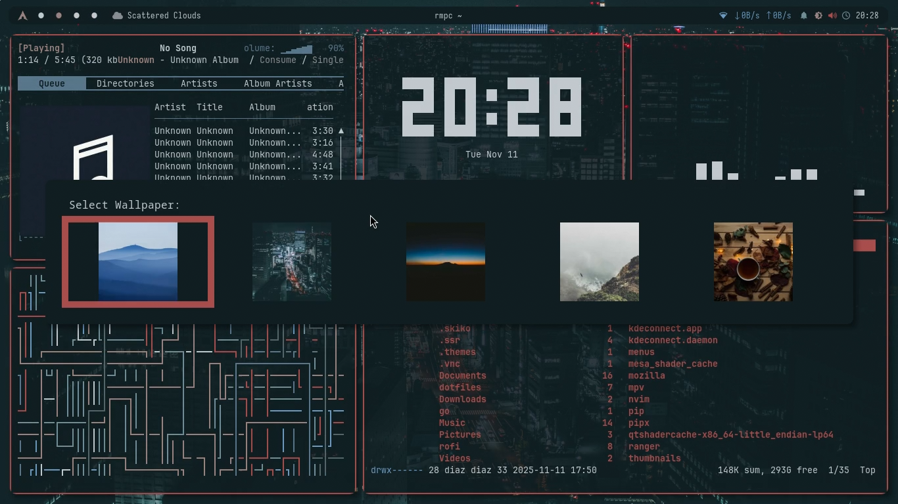
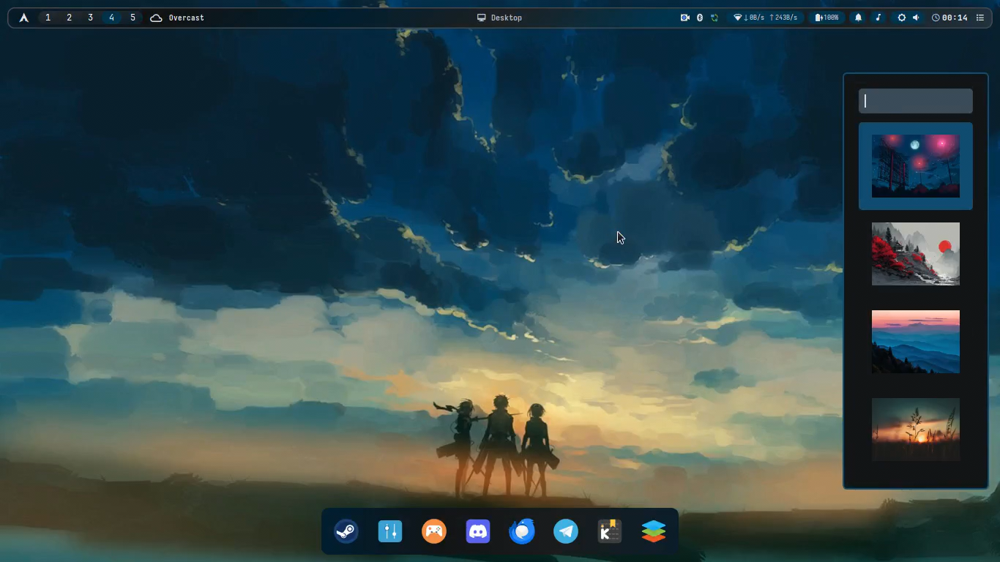

# 🎨 Simple Auto-Ricing i3wm Dotfiles

<div align="center">

**Minimal i3wm environment with automated color theming from wallpapers**

[](https://opensource.org/licenses/MIT)
[](https://archlinux.org/)
[](https://i3wm.org/)

</div>

---

## 📸 Screenshots

<table>
  <tr>
    <td><br/><sub><b>Clean Desktop</b></sub></td>
    <td><br/><sub><b>Busy Desktop</b></sub></td>
  </tr>
  <tr>
    <td colspan="2" align="center"><br/><sub><b>Rofi Application Launcher</b></sub></td>
  </tr>
</table>

---

## ✨ Features

- **Auto Color Theming** - `pywal` + `wpgtk` generate schemes from wallpapers
- **Lightweight** - Minimal resource usage, fast performance
- **Complete Setup** - i3wm, Polybar, Rofi, Alacritty, Fish shell, Eww widgets
- **One-Click Install** - Automated script with backup system

---

## 🧩 Components

| Category | Application | Purpose |
| :--- | :--- | :--- |
| **WM** | i3-wm | Tiling window manager |
| **Bar** | Polybar | Status bar |
| **Terminal** | Alacritty | GPU-accelerated terminal |
| **Shell** | Fish | User-friendly shell |
| **Theming** | pywal + wpgtk | Auto color generation |
| **Launcher** | Rofi | App launcher/switcher |
| **Compositor** | Picom | Transparency & effects |
| **Widgets** | Eww | System monitoring |
| **File Manager** | PCManFM | Lightweight GUI |
| **Wallpaper** | feh | Image viewer |

---

## 📋 Requirements

- **OS**: Arch Linux or derivatives
- **Display**: X11/Xorg
- **Internet**: For package downloads
- AUR helper auto-installed if missing

---

## ⚡ Installation
```bash
git clone https://github.com/MDiaznf23/simple-autoricing-i3wm-dotfiles.git
cd simple-autoricing-i3wm-dotfiles
chmod +x install.sh
./install.sh
```

### ⚠️ Warning
Script will:
- Install packages from official repos & AUR
- Change default shell to Fish
- **Backup & overwrite** configs in `~/.config`, `~/.Xresources`
- Install Python packages via pipx

**Backup created**: `~/dotfiles_backup_YYYYMMDD_HHMMSS`

---

## 🚀 Post-Installation

1. **Logout** → Select **i3** session → **Login**
2. Fish shell active on next login

### Default Keybindings
- **Mod Key**: `Super` (Windows key)
- **Terminal**: `Mod + Enter`
- **Launcher**: `Mod + d`
- **Close Window**: `Mod + Shift + q`
- **Reload i3**: `Mod + Shift + r`

Full keybinds: `~/.config/i3/config`

---

## 🎨 Customization

### Wallpaper Selector

<div align="center">

</div>

**Keybind**: `Mod + Shift + b` - Opens wpg wallpaper picker

### WPG Commands
```bash
wpg -s wallpaper.jpg         # Apply wallpaper
wpg -a ~/Pictures/wall.jpg   # Add to collection
wpg -d wallpaper.jpg         # Delete theme
```

### Edit Configs
```bash
nano ~/.config/i3/config       # i3 keybinds
nano ~/.config/polybar/config  # Polybar settings
```
Reload with `Mod + Shift + r` after changes.

---

## 🆘 Troubleshooting

**Fonts issue**: `sudo pacman -S ttf-font-awesome ttf-jetbrains-mono nerd-fonts-complete`

**No transparency**: `picom --config ~/.config/picom/picom.conf &`

**Wallpaper not changing**: `feh --bg-scale /path/to/wallpaper.jpg`

---

## 🙏 Credits

Inspired by [chameleon-lizard/autorice](https://github.com/chameleon-lizard/autorice) and the Arch/r/unixporn communities.

---

## 📞 Support

- [GitHub Issues](https://github.com/MDiaznf23/simple-autoricing-i3wm-dotfiles/issues)
- [Arch Wiki](https://wiki.archlinux.org/)
- [r/i3wm](https://reddit.com/r/i3wm)

---

<div align="center">

**Made with ❤️ for Arch Linux**

⭐ Star if helpful!

</div>
