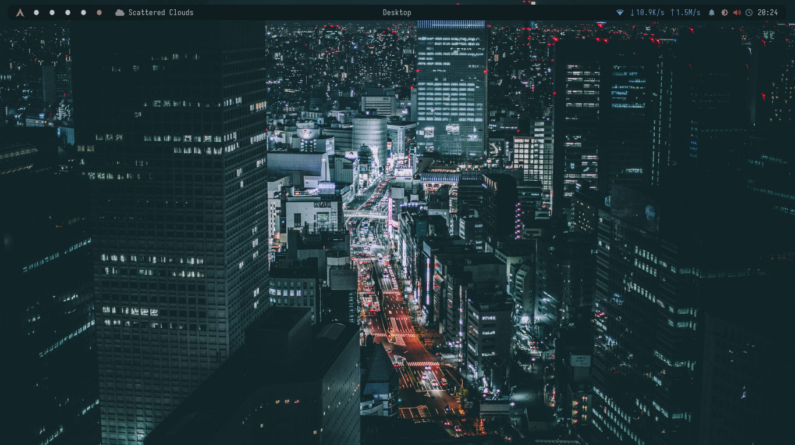
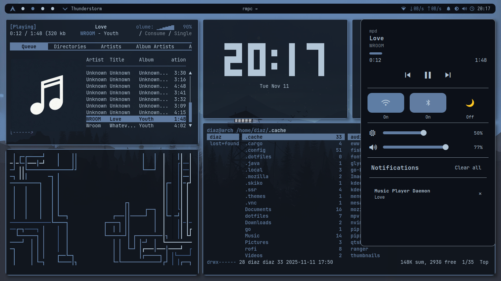

# 🎨 Simple Auto-Ricing i3wm Dotfiles

<div align="center">

**Minimal, functional, and aesthetically pleasing i3wm environment with automated color theming**

[](https://opensource.org/licenses/MIT)
[](https://archlinux.org/)
[](https://i3wm.org/)

</div>

---

## 📸 Screenshots

<table>
  <tr>
    <td><br/><sub><b>Clean Desktop</b></sub></td>
    <td><br/><sub><b>Busy Desktop</b></sub></td>
  </tr>
  <tr>
    <td colspan="2" align="center"><br/><sub><b>Rofi Application Launcher</b></sub></td>
  </tr>
</table>

---

## ✨ Features

- 🎨 **Automatic Color Theming** - Dynamic color schemes generated from your wallpaper using `pywal` and `wpgtk`
- 🐚 **Modern Shell Experience** - Fish shell with enhanced productivity features
- 🪟 **Tiling Window Management** - Efficient workspace management with i3wm
- 🎯 **Lightweight & Fast** - Minimal resource usage with carefully selected components
- 🔧 **Easy Installation** - Automated setup script for quick deployment
- 🎨 **Customizable Widgets** - Modern UI elements powered by Eww

---

## 🧩 Components

| Category | Application | Description |
| :--- | :--- | :--- |
| **Window Manager** | `i3-wm` | Tiling window manager |
| **Status Bar** | `Polybar` | Highly customizable status bar |
| **Terminal Emulator** | `Alacritty` | GPU-accelerated terminal |
| **Default Shell** | `Fish` | User-friendly command line shell |
| **Theming Engine** | `pywal` & `wpgtk` | Automatic color scheme generation |
| **Application Launcher** | `Rofi` | Fast application launcher and switcher |
| **Compositor** | `Picom` | Lightweight compositor for transparency and effects |
| **Widgets** | `Eww` | Elkowar's Wacky Widgets for system monitoring |
| **File Manager** | `PCManFM` | Lightweight file manager |
| **Wallpaper Manager** | `feh` | Fast and light image viewer |
| **Utilities** | Various | `scrot`, `brightnessctl`, `xclip`, and more |

---

## 📋 Prerequisites

- **Operating System**: Arch Linux or derivatives (EndeavourOS, Manjaro, CachyOS, etc.)
- **Display Server**: X11 (Xorg)
- **AUR Helper**: `yay` or `paru` (will be installed automatically if not present)
- **Internet Connection**: Required for package downloads

---

## ⚡ Installation

### Quick Install

```bash
# Clone the repository
git clone https://github.com/MDiaznf23/simple-autoricing-i3wm-dotfiles.git
cd simple-autoricing-i3wm-dotfiles

# Make the installation script executable
chmod +x install.sh

# Run the installer
./install.sh
```

### ⚠️ Important Warning

**This installation script will:**
- Install multiple packages from official repositories and AUR
- Change your default shell to Fish
- **Backup and overwrite** existing configuration files in `~/.config`
- Modify your `~/.Xresources` file
- Install Python packages using `pipx`

**Please review the script before running and ensure you have backups of important configurations.**

---

## 🔧 What the Installation Does

The `install.sh` script performs the following operations:

### 1. **System Preparation**
   - Checks for AUR helper (`yay` or `paru`)
   - Installs `yay` if neither is present
   - Updates system package database

### 2. **Backup Creation**
   - Creates timestamped backup directory: `~/dotfiles_backup_YYYYMMDD_HHMMSS`
   - Backs up:
     - `~/.config/` directory
     - `~/.cache/` directory
     - `~/.local/` directory
     - `~/.Xresources` file

### 3. **Package Installation**
   - **Official Repositories**: Installs core packages (i3-wm, polybar, alacritty, rofi, fish, etc.)
   - **AUR**: Installs `eww` (Elkowar's Wacky Widgets)

### 4. **Shell Configuration**
   - Changes default shell to Fish using `chsh`
   - Configures Fish shell environment

### 5. **Python Environment**
   - Installs Python packages via `pipx`:
     - `pywal` - Color scheme generator
     - `wpgtk` - Wallpaper and theming manager
   - Runs `wpg-install.sh` setup scripts

### 6. **Dotfiles Deployment**
   - Copies configuration files to appropriate locations:
     - `~/.config/` - Application configurations
     - `~/.cache/` - Cache files
     - `~/.local/` - Local user data
     - `~/.Xresources` - X11 resources

### 7. **Permissions & Final Setup**
   - Makes scripts executable:
     - Autostart scripts
     - Polybar launcher
     - Rofi menus
   - Merges `.Xresources` into X server database

---

## 🚀 Post-Installation

After successful installation:

1. **Log Out** of your current session
2. **Select i3** from your display manager's session menu
3. **Log In** to start your new environment
4. Your terminal will automatically use the **Fish shell**

### First Launch Tips

- **Mod Key**: The default modifier key is `Super` (Windows key)
- **Open Terminal**: `Mod + Enter`
- **Application Launcher**: `Mod + d` (opens Rofi)
- **Close Window**: `Mod + Shift + q`
- **Reload Configuration**: `Mod + Shift + r`

For a complete list of keybindings, check `~/.config/i3/config`

---

## 🎨 Customization

### Changing Wallpapers

Use `wpgtk` to manage wallpapers and color schemes:

```bash
wpg
```

Select a wallpaper, and the color scheme will automatically update across all applications.

### Modifying Keybindings

Edit the i3 configuration file:

```bash
nano ~/.config/i3/config
```

After making changes, reload i3 with `Mod + Shift + r`

### Customizing Polybar

Edit the Polybar configuration:

```bash
nano ~/.config/polybar/config.ini
```

Restart Polybar to apply changes.

---

## 🆘 Troubleshooting

### Issue: Fonts not displaying correctly
**Solution**: Install additional fonts:
```bash
sudo pacman -S ttf-font-awesome ttf-jetbrains-mono nerd-fonts-complete
```

### Issue: Transparency not working
**Solution**: Ensure Picom is running:
```bash
picom --config ~/.config/picom/picom.conf &
```

### Issue: Wallpaper not changing
**Solution**: Manually set wallpaper with feh:
```bash
feh --bg-scale /path/to/your/wallpaper.jpg
```

---

## 🤝 Contributing

Contributions are welcome! Feel free to:
- Report bugs
- Suggest new features
- Submit pull requests
- Share your customizations

---

## 📜 License

This project is licensed under the **MIT License** - see the [LICENSE](LICENSE) file for details.

---

## 🙏 Credits & Inspiration

This setup is heavily inspired by and simplified from:
- [chameleon-lizard/autorice](https://github.com/chameleon-lizard/autorice) - Original auto-ricing concept
- The Arch Linux and r/unixporn communities
- All the developers of the amazing tools used in this setup

---

## 📞 Support

If you encounter any issues or have questions:
- Open an issue on [GitHub](https://github.com/MDiaznf23/simple-autoricing-i3wm-dotfiles/issues)
- Check the [Arch Wiki](https://wiki.archlinux.org/) for general Linux help
- Visit [r/i3wm](https://reddit.com/r/i3wm) for i3-specific questions

---

<div align="center">

**Made with ❤️ for the Arch Linux community**

If you found this helpful, consider giving it a ⭐

</div>
